# Sandboxed Coding Agent

This repository contains a reference implementation of a **sandboxed coding agent** that can:

1. **Run shell commands, Python, and TypeScript code** in isolated Firecracker micro-VMs.
2. **Manipulate files and automate GUI interactions** inside the VM via `xdotool`/`xdot` and a virtual X-server exposed through noVNC.
3. **Persist arbitrarily long conversational contexts** on disk with automatic pruning and summarisation.
4. **Expose a fully–featured JupyterLab IDE** accessible over the browser.
5. **Provide REST endpoints** for task orchestration:
   * `POST /schedule` – queue a new job (code, script, or GUI task)
   * `GET  /status/{job_id}` – inspect the status & output of a running/completed job
6. **Package everything inside a single Docker image** that boots an X-server, noVNC, JupyterLab, and the FastAPI control plane.
7. **(Bonus) Support horizontal scaling** through deploy manifests for **Kubernetes** and **HashiCorp Nomad**.

> ⚠️  This project is a reference **prototype**.  It is **not production-hardened** and should be used for experimentation only.

---

## Quick start

```bash
# 1. Build the image
$ docker build -t sandboxed-agent .

# 2. Run the container (maps ports for REST, VNC, and JupyterLab)
$ docker run -it --rm -p 8000:8000 -p 5901:5901 -p 6080:6080 \
             --privileged sandboxed-agent

# 3. Open your browser:
#    • FastAPI docs:   http://localhost:8000/docs
#    • noVNC console:  http://localhost:6080/vnc.html?host=localhost&port=6080
#    • JupyterLab:     http://localhost:8000/lab
```

---

## Repository layout

```
.
├── Dockerfile            # Container image definition
├── docker-compose.yml    # Convenience compose file (local dev)
├── requirements.txt      # Python dependencies
├── README.md             # This file
├── src/
│   ├── agent/            # Core sandboxed agent logic
│   │   ├── __init__.py
│   │   ├── runner.py     # Execute code & shell in Firecracker VMs
│   │   ├── gui.py        # xdot(ool) helpers
│   │   ├── storage.py    # Long-context persistence & pruning
│   │   └── firecracker.py# Thin wrapper around Firecracker API socket
│   └── api/
│       └── main.py       # FastAPI app exposing /schedule & /status
├── k8s/                  # Kubernetes manifests (bonus)
│   ├── deployment.yaml
│   └── service.yaml
└── nomad/                # Nomad job spec (bonus)
    └── job.nomad
```

---

## Architectural overview

```mermaid
flowchart TD
    subgraph container [Docker Container]
        agent["🧠 Agent core (Python)"]
        firecrackerd[["Firecracker VMM"]]
        xvfb[["Xvfb :1"]]
        novnc[["noVNC"]]
        jupyter[["JupyterLab"]]
        agent -->|control| firecrackerd
        firecrackerd -->|spawns| vm["MicroVM(s)"]
        vm --> xvfb
        xvfb --> novnc
        agent --> jupyter
    end
```



* **Agent core** launches isolated **Firecracker micro-VMs** for each task, mounts a temporary overlay filesystem, and streams stdout/stderr back to the host.
* **Xvfb** provides a virtual display; **noVNC** exposes it over WebSockets so you can watch the VM desktop.
* **JupyterLab** is proxied through FastAPI for an IDE-like experience.

---

## REST API

### `POST /schedule`
Queue a new job.

```json
{
  "kind": "python"|"shell"|"typescript"|"gui",
  "code": "print(\"hello\")"   // or shell/TS/Xdot commands
}
```

Returns:

```json
{ "job_id": "uuid4" }
```

### `GET /status/{job_id}`
Retrieve current state and streamed logs.

```json
{
  "state": "queued"|"running"|"succeeded"|"failed",
  "stdout": "...",
  "stderr": "..."
}
```

---

## Scaling out (bonus)

* **Kubernetes**: apply the manifests in `k8s/` for a `Deployment` + `Service`.
* **Nomad**: `nomad run nomad/job.nomad` spins up the agent as a Nomad job.

---

## Roadmap / TODO

- [ ] Network egress restrictions & seccomp filter tuning
- [ ] TLS termination for API & VNC
- [ ] S3/GCS backed long-term log storage
- [ ] Multi-tenant authentication & quotas
- [ ] Advanced context pruning strategies (vector store, semantic summarisation) 